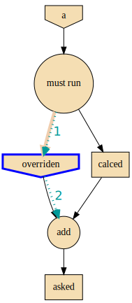

#########
Changelog
#########

v1.3.0 (Oct 2019): New DAG solver, better plotting & "sideffect"
================================================================

Kept external API (hopefully) the same, but revamped pruning algorithm and
refactored network compute/compile structure, so results may change; significantly
enhanced plotting.  The only new feature actually is the :class:`sideffect`` modifier.

Network:
--------

+ FIX(:gh:`18`, :gh:`26`, :gh:`29`, :gh:`17`, :gh:`20`): Revamped DAG SOLVER
  to fix bad pruning described in :gh:`24` & :gh:`25`

  Pruning now works by breaking incoming provide-links to any given
  intermedediate inputs dropping operations with partial inputs or without outputs.

  The end result is that operations in the graph that do not have all inputs satisfied,
  they are skipped (in v1.2.4 they crashed).

  Also started annotating edges with optional/sideffects, to make proper use of
  the underlying ``networkx`` graph.

  |v130-flowchart|

+ REFACT(:gh:`21`, :gh:`29`): Refactored Network and introduced :class:`ExecutionPlan` to keep
  compilation results (the old ``steps`` list, plus input/output names).

  Moved also the check for when to evict a value, from running the execution-plan,
  to whenbuilding it; thus, execute methods don't need outputs anymore.

+ ENH(:gh:`26`): "Pin* input values that may be overriten by calculated ones.

  This required the introduction of the new :class:`_PinInstruction` in
  the execution plan.

+ FIX(:gh:`23`, :gh:`22`-2.4.3): Keep consistent order of ``networkx.DiGraph``
  and *sets*, to generate deterministic solutions.

  *Unfortunately*, it non-determinism has not been fixed in < PY3.5, just
  reduced the frequency of `spurious failures
  <https://travis-ci.org/yahoo/graphkit/builds/594729787>`_, caused by
  unstable dicts, and the use of subgraphs.

+ enh: Mark outputs produced by :class:`NetworkOperation`'s needs as ``optional``.
  TODO: subgraph network-operations would not be fully functional until
  *"optional outpus"* are dealt with (see :gh:`22`-2.5).

+ enh: Annotate operation exceptions with ``ExecutionPlan`` to aid debug sessions,

+ drop: methods ``list_layers()``/``show layers()`` not needed, ``repr()`` is
  a better replacement.

Plotting:
---------

+ ENH(:gh:`13`, :gh:`26`, :gh:`29`): Now network remembers last plan and uses that
  to overlay graphs with the internals of the planing and execution: |sample-plot|

    - execution-steps & order
    - evict & pin instructions
    - given inputs & asked outputs
    - solution values (just if they are present)
    - "optional" needs & broken links during pruning

+ REFACT: Move all API doc on plotting in a single module, splitted in 2 phases,
  build DOT & render DOT

+ FIX(:gh:`13`): bring plot writing into files up-to-date from PY2; do not create plot-file
  if given file-extension is not supported.

+ FEAT: path `pydot library <https://pypi.org/project/pydot/>`_ to support rendering
  in *Jupyter notebooks*.

Testing & other code:
---------------------

 - Increased coverage from 77% --> 90%.

+ ENH(:gh:`28`): use ``pytest``, to facilitate TCs parametrization.

+ ENH(:gh:`30`): Doctest all code; enabled many assertions that were just print-outs
  in v1.2.4.

+ FIX: ``operation.__repr__()`` was crashing when not all arguments
  had been set - a condition frequtnly met during debugging session or failed
  TCs (inspired by @syamajala's 309338340).

+ enh: Sped up parallel/multihtread TCs by reducing delays & repetitions.

  .. tip::
    You need ``pytest -m slow`` to run those slow tests.

Chore & Docs:
-------------

+ FEAT: add changelog in ``CHANGES.rst`` file, containing  flowcharts
  to compare versions ``v1.2.4 <--> v1.3..0``.
+ enh: updated site & documentation for all new features, comparing with v1.2.4.
+ enh(:gh:`30`): added "API reference' chapter.
+ drop(build): ``sphinx_rtd_theme`` library is the default theme for Sphinx now.
+ enh(build): Add ``test`` *pip extras*.
+ sound: https://www.youtube.com/watch?v=-527VazA4IQ,
  https://www.youtube.com/watch?v=8J182LRi8sU&t=43s

v1.2.4 (Mar 7, 2018)
====================

+ Issues in pruning algorithm: :gh:`24`, :gh:`25`
+ Blocking bug in plotting code for Python-3.x.
+ Test-cases without assertions (just prints).

|v124-flowchart|

1.2.2 (Mar 7, 2018, @huyng): Fixed versioning
=============================================

Versioning now is manually specified to avoid bug where the version
was not being correctly reflected on pip install deployments

1.2.1 (Feb 23, 2018, @huyng): Fixed multi-threading bug and faster compute through caching of `find_necessary_steps`
====================================================================================================================

We've introduced a cache to avoid computing find_necessary_steps multiple times
during each inference call.

This has 2 benefits:

+ It reduces computation time of the compute call
+ It avoids a subtle multi-threading bug in networkx when accessing the graph
  from a high number of threads.

1.2.0 (Feb 13, 2018, @huyng)
============================

Added `set_execution_method('parallel')` for execution of graphs in parallel.

1.1.0 (Nov 9, 2017, @huyng)
===========================

Update setup.py

1.0.4 (Nov 3, 2017, @huyng): Networkx 2.0 compatibility
=======================================================

Minor Bug Fixes:

+ Compatibility fix for networkx 2.0
+ `net.times` now only stores timing info from the most recent run

1.0.3 (Jan 31, 2017, @huyng): Make plotting dependencies optional
=================================================================

+ Merge pull request :gh:`6` from yahoo/plot-optional
+ make plotting dependencies optional

1.0.2 (Sep 29, 2016, @pumpikano): Merge pull request :gh:`5` from yahoo/remove-packaging-dep
============================================================================================

+ Remove 'packaging' as dependency

1.0.1 (Aug 24, 2016)
====================

1.0 (Aug 2, 2016, @robwhess)
============================

First public release in PyPi & GitHub.

+ Merge pull request :gh:`3` from robwhess/travis-build
+ Travis build

.. _substitutions:

.. |v130-flowchart| image:: docs/source/images/GraphkitFlowchart-v1.3.0.svg
    :alt: graphkit-v1.3.0 flowchart
    :scale: 75%
.. |v124-flowchart| image:: docs/source/images/GraphkitFlowchart-v1.2.4.svg
    :alt: graphkit-v1.2.4 flowchart
    :scale: 75%
