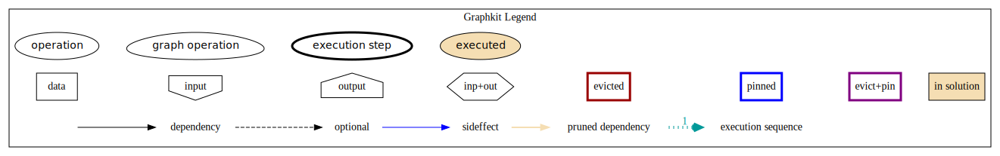

# GraphKit

[](https://img.shields.io/pypi/v/graphkit.svg?label=PyPi%20version)
[](https://img.shields.io/github/v/release/yahoo/graphkit.svg?label=GitHub%20release&include_prereleases)
[](https://img.shields.io/pypi/pyversions/graphkit.svg?label=Python)
[](https://travis-ci.org/yahoo/graphkit)
[](https://codecov.io/gh/yahoo/graphkit)
[](https://img.shields.io/pypi/l/graphkit.svg)

[](https://img.shields.io/github/watchers/yahoo/graphkit.svg?style=social)
[](https://img.shields.io/github/stars/yahoo/graphkit.svg?style=social)
[](https://img.shields.io/github/forks/yahoo/graphkit.svg?style=social)
[](http://img.shields.io/github/issues/yahoo/graphkit.svg?style=social)

[Full Documentation](https://pythonhosted.org/graphkit/)

> It's a DAG all the way down


## Lightweight computation graphs for Python

GraphKit is an an understandable and lightweight Python module for building and running
ordered graphs of computations.
The API posits a fair compromise between features and complexity without precluding any.
It might be of use in computer vision, machine learning and other data science domains,
or become the core of a custom ETL pipelne.

## Quick start

Here's how to install:

    pip install graphkit

OR with dependencies for plotting support (and you need to install [`Graphviz`](https://graphviz.org)
program separately with your OS tools):

    pip install graphkit[plot]

Here's a Python script with an example GraphKit computation graph that produces
multiple outputs (`a * b`, `a - a * b`, and `abs(a - a * b) ** 3`):

    >>> from operator import mul, sub
    >>> from graphkit import compose, operation

    >>> # Computes |a|^p.
    >>> def abspow(a, p):
    ...     c = abs(a) ** p
    ...     return c

    >>> # Compose the mul, sub, and abspow operations into a computation graph.
    >>> graphop = compose(name="graphop")(
    ...     operation(name="mul1", needs=["a", "b"], provides=["ab"])(mul),
    ...     operation(name="sub1", needs=["a", "ab"], provides=["a_minus_ab"])(sub),
    ...     operation(name="abspow1", needs=["a_minus_ab"], provides=["abs_a_minus_ab_cubed"], params={"p": 3})(abspow)
    ... )

    >>> # Run the graph and request all of the outputs.
    >>> out = graphop({'a': 2, 'b': 5})
    >>> print(out)
    {'a': 2, 'b': 5, 'ab': 10, 'a_minus_ab': -8, 'abs_a_minus_ab_cubed': 512}

    >>> # Run the graph and request a subset of the outputs.
    >>> out = graphop({'a': 2, 'b': 5}, outputs=["a_minus_ab"])
    >>> print(out)
    {'a_minus_ab': -8}

    
As you can see, any function can be used as an operation in GraphKit, even ones imported from system modules!


## Plotting

For debugging the above graph-operation you may plot the *execution plan*
of the last computation it using these methods:

```python
graphop.plot(show=True)                # open a matplotlib window
graphop.plot("intro.svg")              # other supported formats: png, jpg, pdf, ...
graphop.plot()                         # without arguments return a pydot.DOT object
graphop.plot(solution=out)             # annotate graph with solution values
```




> **TIP:** The `pydot.Dot` instances returned by `plot()` are rendered as SVG in *Jupyter/IPython*.

# License

Code licensed under the Apache License, Version 2.0 license. See LICENSE file for terms.
