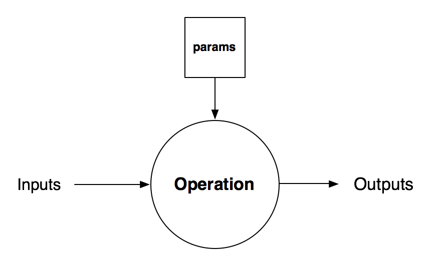

Getting started
===============

Installation
------------

::

    pip install graphkit

Minimal example
---------------

::

    import numpy as np
    from graphkit import network, compose

    # implement an image transformation
    class ImageDiff(Operation):
        def compute(self, inputs):
            a = inputs[0]
            b = inputs[1]
            c = a - b
            return [c]

    if __name__ == "__main__":

        # describe what data your operation needs and provides
        diff_op = ImageDiff(
            name="diff-op",
            needs=["arr-a", "arr-b"],
            provides=["diff-img"]
        )

        # compile it into a processing pipeline
        net = network.Network()
        net.add_op(diff_op)
        net.compile()

        # run your pipeline with concrete data
        out = net.compute(
            outputs=["diff-img"],
            named_inputs={
                "arr-a": np.random.rand(5, 5),
                "arr-b": np.random.rand(5, 5)
            }
        )
        print(out)

Just save this to a file called ``hello_net.py`` and run ::

    $ python hello_net.py

Conceptual overview
-------------------

As a user of this library, you will take action in two common ways:
defining your own data processing operations and creating a network of
computation that ties together various operations into a computational graph.

The two main classes in this library to study are  ``Network`` and ``Operation``.

What is an Operation?
^^^^^^^^^^^^^^^^^^^^^

At its core, the ``Operation`` class represents the basic unit of data transformation. Operations take input data and transform it into output data through its ``compute`` method.

The ``Operation`` class also has the concept of ``parameters`` that are associated with it. These parameters are accessible to the ``compute`` method during compute-time, and they are set during the instantionation of the ``Operation`` class.

Defining your own operations
^^^^^^^^^^^^^^^^^^^^^^^^^^^^

To define your own operation, sub-class the `Operation` type, and implement your own `compute(self, inputs)` method.

Below we show an example of how to implement a basic `Sum` operation.

::

    from flickr.vision.graphkit import Operation

    class Sum(Operation):
        def compute(self, inputs):
            a = inputs[0]
            b = inputs[1]
            return [a+b]

The ``inputs`` variable here is assumed to be a list of input data. The return value must be a list of ``outputs``.

We'll see later on how we know what will get passed in as inputs.

Parameter intialization
^^^^^^^^^^^^^^^^^^^^^^^

As stated earlier, some operations may be initialized with their own parameters. For example, a simple classifer that returns true or false  based on some pre-defined threshold value might have a parameter called "threshold" associated with it.

Here's how you can define an operation to use this parameter.

::

    from flickr.vision.pipeline import Operation

    class ThresholdClassifier(Operation):

        def compute(self, inputs):
            t = self.params["threshold"]
            a = inputs[0]
            r = True if a > t else False
            return [r]

Notice the reference to ``self.params["threshold"]``? Your compute method can assume that it has access to all parameters inside the ``self.params`` dictionary.

These parameters are passed in during instantiation of your operation.

Instantiating operations
^^^^^^^^^^^^^^^^^^^^^^^^

Once you define an operation, you can instantiate it. This step achieves a few purposes,

    1. It tells the operation where its input data will be coming from,
    2. It tells the operation what to call or name its output data
    3. It assigns concrete values to its parameters

Here's our ``ThresholdClassifier`` operation being instantatiated:

::

    thresh_class_op = ThresholdClassifier(
        name="threshold_op",
        needs=["a"],
        provides=["is-above-threshold"]
        params={"threshold": 5}
    )

Every operation must be instantiated with at least 3 arguments:

* name (required)
    * a unique name for the particular operation
* needs (required)
    * a list of inputs that the operation needs to run. the order here will be the same order that inputs are provided to the operation's `compute` function
* provides (required)
    * a list of named outputs in the order they are returned from the operation's ``compute`` function
* params (optional)
    * this is a dictionary of key/value pairs that are needed for the correct functioning of your operation. **All values stored in here must be pickelable**

Networks
--------

Once we've defined operations, we'll want to combine them together in order to create a directed graph of computation. The ``Network`` object allows us to do this.

A ``Network`` is the high level object that connects together several operations into a directed acyclic graph.

Creating a network and adding operations
^^^^^^^^^^^^^^^^^^^^^^^^^^^^^^^^^^^^^^^^

::

    from flickr.vision.graphkit import network
    from flickr.vision.graphkit import Operation

    net = network.Network()
    net.add_op(some_operation)
    net.add_op(another_operation)
    net.compile()

The ``compile`` method here will analyze each operation's ``needs`` and ``provides`` attributes and form an execution plan for your processing pipeline.

It will also prune out unused operations for you.

Processing data with the network dag
^^^^^^^^^^^^^^^^^^^^^^^^^^^^^^^^^^^^

Once defined, you can push data through the directed graph of operations like so:

::

    net.compute(outputs=["data_out"],
                named_inputs={"data_in_a": 12,
                              "data_in_b": 11})

The ``outputs`` variable here is a list of data nodes you want to output as the result of the computation.

The variable `named_inputs` is all of the data nodes you want to prefill with data as input.

Serialization
^^^^^^^^^^^^^

::

    # you can serialize individual operations
    import cPickle as pkl
    with open("threshold_op.pkl", "wb") as fh:
        pkl.dump(threshold_op, fh, pkl.HIGHEST_PROTOCOL)

    # or you can serialize an entire network
    import cPickle as pkl
    with open("net.pkl", "wb") as fh:
        pkl.dump(net, fh, pkl.HIGHEST_PROTOCOL)

Full example
------------

Below, we provide a complete example of using this library to create a processing pipeline.

.. code-block:: python

    from flickr.vision.graphkit import Operation
    from flickr.vision.graphkit import network

    # We first define some basic operations
    class Sum(Operation):
        def compute(self, inputs):
            a = inputs[0]
            b = inputs[1]
            return [a+b]

    class Mul(Operation):
        def compute(self, inputs):
            a = inputs[0]
            b = inputs[1]
            return [a*b]

    class Pow(Operation):
        # This is an example of an operation that takes a parameter.
        # It also illustrates an operation that returns multiple outputs

        def compute(self, inputs):
            import math

            a = inputs[0]
            outputs = []
            for y in range(1, self.params['exponent']+1):
                p = math.pow(a, y)
                outputs.append(p)
            return outputs

    if __name__ == '__main__':

        # We now instantiate multiple operations and define
        # the data flow between each operation

        sum_op1 = Sum(
            name="sum_op1",
            provides=["sum_ab"],
            needs=["a", "b"]
        )
        mul_op1 = Mul(
            name="mul_op1",
            provides=["sum_ab_times_b"],
            needs=["sum_ab", "b"]
        )
        pow_op1 = Pow(
            name="pow_op1",
            needs=["sum_ab"],
            provides=["sum_ab_p1", "sum_ab_p2", "sum_ab_p3"],
            params={"exponent": 3}
        )
        sum_op2 = Sum(
            name="sum_op2",
            provides=["p1_plus_p2"],
            needs=["sum_ab_p1", "sum_ab_p2"],
        )

        net = network.Network()
        net.add_op(sum_op1)
        net.add_op(mul_op1)
        net.add_op(pow_op1)
        net.add_op(sum_op2)
        net.compile()

        #
        # Running the network
        #
        from pprint import pprint

        # get all outputs
        pprint(net.compute(outputs=network.ALL_OUTPUTS, named_inputs={"a":1, "b":2}))

        # get specific outputs
        pprint(net.compute(outputs=["sum_ab_times_b"], named_inputs={"a":1, "b":2}))

        # visualize network graph
        net.plot(show=True)

        # Serialization
        import pickle

        # seriliaze entire network
        pickle.dump(net, open("net.pkl", "wb"), pickle.HIGHEST_PROTOCOL)

        # serialize individual operations
        pickle.dump(pow_op1, open("pow_op1.pkl", "wb"), pickle.HIGHEST_PROTOCOL)

Expected output

::

    {'a': 1,
     'b': 2,
     'p1_plus_p2': 12.0,
     'sum_ab': 3,
     'sum_ab_p1': 3.0,
     'sum_ab_p2': 9.0,
     'sum_ab_p3': 27.0,
     'sum_ab_times_b': 6}
    {'sum_ab_times_b': 6}
