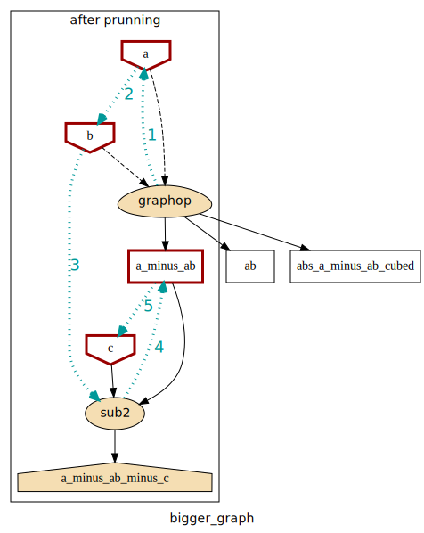

.. _graph-composition:

Graph Composition and Use
=========================

GraphKit's ``compose`` class handles the work of tying together ``operation`` instances into a runnable computation graph.

The ``compose`` class
---------------------

For now, here's the specification of ``compose``.  We'll get into how to use it in a second.

.. autoclass:: graphkit.compose
   :members: __call__

.. _simple-graph-composition:

Simple composition of operations
--------------------------------

The simplest use case for ``compose`` is assembling a collection of individual operations into a runnable computation graph.  The example script from :ref:`quick-start` illustrates this well::

   >>> from operator import mul, sub
   >>> from graphkit import compose, operation

   >>> # Computes |a|^p.
   >>> def abspow(a, p):
   ...    c = abs(a) ** p
   ...    return c

   >>> # Compose the mul, sub, and abspow operations into a computation graph.
   >>> graphop = compose(name="graphop")(
   ...    operation(name="mul1", needs=["a", "b"], provides=["ab"])(mul),
   ...    operation(name="sub1", needs=["a", "ab"], provides=["a_minus_ab"])(sub),
   ...    operation(name="abspow1", needs=["a_minus_ab"], provides=["abs_a_minus_ab_cubed"], params={"p": 3})(abspow)
   ... )

The call here to ``compose()`` yields a runnable computation graph that looks like this (where the circles are operations, squares are data, and octagons are parameters):

.. image:: images/intro.svg

.. _graph-computations:

Running a computation graph
---------------------------

The graph composed in the example above in :ref:`simple-graph-composition` can be run
by simply calling it with a dictionary argument whose keys correspond to the names of inputs
to the graph and whose values are the corresponding input values.
For example, if ``graph`` is as defined above, we can run it like this::

   # Run the graph and request all of the outputs.
   >>> out = graphop({'a': 2, 'b': 5})
   >>> out
   {'a': 2, 'b': 5, 'ab': 10, 'a_minus_ab': -8, 'abs_a_minus_ab_cubed': 512}

Producing a subset of outputs
^^^^^^^^^^^^^^^^^^^^^^^^^^^^^

By default, calling a graph-operation on a set of inputs will yield all of that graph's outputs.  You can use the ``outputs`` parameter to request only a subset.  For example, if ``graphop`` is as above::

   # Run the graph-operation and request a subset of the outputs.
   >>> out = graphop({'a': 2, 'b': 5}, outputs=["a_minus_ab"])
   >>> out
   {'a_minus_ab': -8}

When using ``outputs`` to request only a subset of a graph's outputs, GraphKit executes only the ``operation`` nodes in the graph that are on a path from the inputs to the requested outputs.  For example, the ``abspow1`` operation will not be executed here.

Short-circuiting a graph computation
^^^^^^^^^^^^^^^^^^^^^^^^^^^^^^^^^^^^

You can short-circuit a graph computation, making certain inputs unnecessary, by providing a value in the graph that is further downstream in the graph than those inputs.  For example, in the graph-operation we've been working with, you could provide the value of ``a_minus_ab`` to make the inputs ``a`` and ``b`` unnecessary::

   # Run the graph-operation and request a subset of the outputs.
   >>> out = graphop({'a_minus_ab': -8})
   >>> out
   {'a_minus_ab': -8, 'abs_a_minus_ab_cubed': 512}

When you do this, any ``operation`` nodes that are not on a path from the downstream input to the requested outputs (i.e. predecessors of the downstream input) are not computed.  For example, the ``mul1`` and ``sub1`` operations are not executed here.

This can be useful if you have a graph-operation that accepts alternative forms of the same input.  For example, if your graph-operation requires a ``PIL.Image`` as input, you could allow your graph to be run in an API server by adding an earlier ``operation`` that accepts as input a string of raw image data and converts that data into the needed ``PIL.Image``.  Then, you can either provide the raw image data string as input, or you can provide the ``PIL.Image`` if you have it and skip providing the image data string.

Adding on to an existing computation graph
------------------------------------------

Sometimes you will have an existing computation graph to which you want to add operations.  This is simple, since ``compose`` can compose whole graphs along with individual ``operation`` instances.  For example, if we have ``graph`` as above, we can add another operation to it to create a new graph::

   >>> # Add another subtraction operation to the graph.
   >>> bigger_graph = compose(name="bigger_graph")(
   ...    graphop,
   ...    operation(name="sub2", needs=["a_minus_ab", "c"], provides="a_minus_ab_minus_c")(sub)
   ... )

   >>> # Run the graph and print the output.
   >>> sol = bigger_graph({'a': 2, 'b': 5, 'c': 5}, outputs=["a_minus_ab_minus_c"])
   >>> sol
   {'a_minus_ab_minus_c': -13}

This yields a graph which looks like this (see :ref:`Plotting`):

More complicated composition: merging computation graphs
----------------------------------------------------------

Sometimes you will have two computation graphs---perhaps ones that share operations---you want to combine into one.  In the simple case, where the graphs don't share operations or where you don't care whether a duplicated operation is run multiple (redundant) times, you can just do something like this::

   combined_graph = compose(name="combined_graph")(graph1, graph2)

However, if you want to combine graphs that share operations and don't want to pay the price of running redundant computations, you can set the ``merge`` parameter of ``compose()`` to ``True``.  This will consolidate redundant ``operation`` nodes (based on ``name``) into a single node.  For example, let's say we have ``graphop``, as in the examples above, along with this graph::

   >>> # This graph shares the "mul1" operation with graph.
   >>> another_graph = compose(name="another_graph")(
   ...    operation(name="mul1", needs=["a", "b"], provides=["ab"])(mul),
   ...    operation(name="mul2", needs=["c", "ab"], provides=["cab"])(mul)
   ... )

We can merge ``graphop`` and ``another_graph`` like so, avoiding a redundant ``mul1`` operation::

   >>> merged_graph = compose(name="merged_graph", merge=True)(graphop, another_graph)
   >>> print(merged_graph)
    NetworkOperation(name='merged_graph', needs=IndexedSet(['a', 'b', 'c']),
    provides=IndexedSet(['ab', 'a_minus_ab', 'abs_a_minus_ab_cubed', 'cab']))

This ``merged_graph`` will look like this:

As always, we can run computations with this graph by simply calling it::

   >>> merged_graph({'a': 2, 'b': 5, 'c': 5}, outputs=["cab"])
   {'cab': 50}
