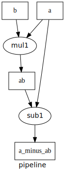

.. graphkit documentation master file, created by
   sphinx-quickstart on Tue Jun 16 19:10:27 2016.
   You can adapt this file completely to your liking, but it should at least
   contain the root `toctree` directive.

========
GraphKit
========

|travis-status| |cover-status| |gh-version| |pypi-version| |python-ver|
|dev-status| |downloads-count| |codestyle| |proj-lic|

|gh-watch| |gh-star| |gh-fork| |gh-issues|

**It's a DAG all the way down!** |sample-plot|

Lightweight computation graphs for Python
-----------------------------------------

GraphKit is an an understandable and lightweight Python module for building and running
ordered graphs of computations.
The API posits a fair compromise between features and complexity without precluding any.
It might be of use in computer vision, machine learning and other data science domains,
or become the core of a custom ETL pipelne.

.. toctree::
   :maxdepth: 2

   operations
   composition
   plotting
   reference
   changes

.. _quick-start:

Quick start
-----------

Here's how to install::

   pip install graphkit

OR with dependencies for plotting support (and you need to install `Graphviz
<https://graphviz.org>`_ program separately with your OS tools)::

   pip install graphkit[plot]

Here's a Python script with an example GraphKit computation graph that produces multiple outputs (``a * b``, ``a - a * b``, and ``abs(a - a * b) ** 3``)::

   >>> from operator import mul, sub
   >>> from graphkit import compose, operation

   # Computes |a|^p.
   >>> def abspow(a, p):
   ...    c = abs(a) ** p
   ...    return c

   >>> # Compose the mul, sub, and abspow operations into a computation graph.
   >>> graphop = compose(name="graphop")(
   ...    operation(name="mul1", needs=["a", "b"], provides=["ab"])(mul),
   ...    operation(name="sub1", needs=["a", "ab"], provides=["a_minus_ab"])(sub),
   ...    operation(name="abspow1", needs=["a_minus_ab"], provides=["abs_a_minus_ab_cubed"], params={"p": 3})(abspow)
   ... )

   >>> # Run the graph-operation and request all of the outputs.
   >>> graphop({'a': 2, 'b': 5})
   {'a': 2, 'b': 5, 'ab': 10, 'a_minus_ab': -8, 'abs_a_minus_ab_cubed': 512}

   >>> # Run the graph-operation and request a subset of the outputs.
   >>> graphop({'a': 2, 'b': 5}, outputs=["a_minus_ab"])
   {'a_minus_ab': -8}

As you can see, any function can be used as an operation in GraphKit,
even ones imported from system modules!

License
-------

Code licensed under the Apache License, Version 2.0 license. See LICENSE file for terms.

.. |travis-status| image:: https://travis-ci.org/yahoo/graphkit.svg
    :alt: Travis continuous integration testing ok? (Linux)
    :target: https://travis-ci.org/yahoo/graphkit/builds

.. |cover-status| image:: https://codecov.io/gh/yahoo/graphkit/branch/master/graph/badge.svg
    :target: https://codecov.io/gh/yahoo/graphkit

.. |gh-version| image::  https://img.shields.io/github/v/release/yahoo/graphkit.svg?label=GitHub%20release&include_prereleases
    :target: https://github.com/yahoo/graphkit/releases
    :alt: Latest version in GitHub

.. |pypi-version| image::  https://img.shields.io/pypi/v/graphkit.svg?label=PyPi%20version
    :target: https://pypi.python.org/pypi/graphkit/
    :alt: Latest version in PyPI

.. |python-ver| image:: https://img.shields.io/pypi/pyversions/graphkit.svg?label=Python
    :target: https://pypi.python.org/pypi/graphkit/
    :alt: Supported Python versions of latest release in PyPi

.. |dev-status| image:: https://pypip.in/status/graphkit/badge.svg
    :target: https://pypi.python.org/pypi/graphkit/
    :alt: Development Status

.. |downloads-count| image:: https://pypip.in/download/graphkit/badge.svg?period=month&label=PyPi%20downloads
    :target: https://pypi.python.org/pypi/graphkit/
    :alt: PyPi downloads

.. |codestyle| image:: https://img.shields.io/badge/code%20style-black-black.svg
    :target: https://github.com/ambv/black
    :alt: Code Style

.. |gh-watch| image:: https://img.shields.io/github/watchers/yahoo/graphkit.svg?style=social
    :target: https://github.com/yahoo/graphkit
    :alt: Github watchers

.. |gh-star| image:: https://img.shields.io/github/stars/yahoo/graphkit.svg?style=social
    :target: https://github.com/yahoo/graphkit
    :alt: Github stargazers

.. |gh-fork| image:: https://img.shields.io/github/forks/yahoo/graphkit.svg?style=social
    :target: https://github.com/yahoo/graphkit
    :alt: Github forks

.. |gh-issues| image:: http://img.shields.io/github/issues/yahoo/graphkit.svg?style=social
    :target: https://github.com/yahoo/graphkit/issues
    :alt: Issues count

.. |proj-lic| image:: https://img.shields.io/pypi/l/graphkit.svg
    :target:  https://www.apache.org/licenses/LICENSE-2.0
    :alt: Apache License, version 2.0

