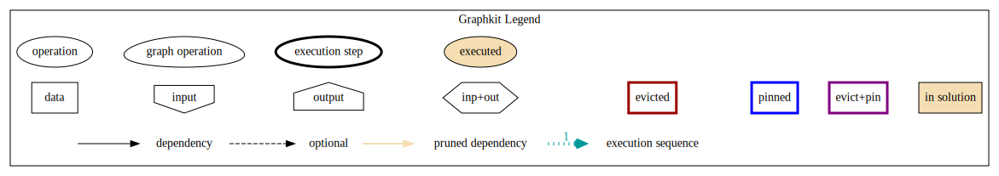

.. graphkit documentation master file, created by
   sphinx-quickstart on Tue Jun 16 19:10:27 2016.
   You can adapt this file completely to your liking, but it should at least
   contain the root `toctree` directive.

========
GraphKit
========

.. image:: https://badge.fury.io/py/graphkit.svg
   :target: https://badge.fury.io/py/graphkit
.. image:: https://travis-ci.org/yahoo/graphkit.svg?branch=master
   :target: https://travis-ci.org/yahoo/graphkit
.. image:: https://codecov.io/gh/yahoo/graphkit/branch/master/graph/badge.svg
   :target: https://codecov.io/gh/yahoo/graphkit

**It's a DAG all the way down**

.. toctree::
   :maxdepth: 2

   operations
   graph_composition

Lightweight computation graphs for Python
-----------------------------------------

GraphKit is a lightweight Python module for creating and running ordered graphs of computations, where the nodes of the graph correspond to computational operations, and the edges correspond to output --> input dependencies between those operations.  Such graphs are useful in computer vision, machine learning, and many other domains.

.. _quick-start:

Quick start
-----------

Here's how to install::

   pip install graphkit

Here's a Python script with an example GraphKit computation graph that produces multiple outputs (``a * b``, ``a - a * b``, and ``abs(a - a * b) ** 3``)::

   from operator import mul, sub
   from graphkit import compose, operation

   # Computes |a|^p.
   def abspow(a, p):
      c = abs(a) ** p
      return c

   # Compose the mul, sub, and abspow operations into a computation graph.
   graph = compose(name="graph")(
      operation(name="mul1", needs=["a", "b"], provides=["ab"])(mul),
      operation(name="sub1", needs=["a", "ab"], provides=["a_minus_ab"])(sub),
      operation(name="abspow1", needs=["a_minus_ab"], provides=["abs_a_minus_ab_cubed"], params={"p": 3})(abspow)
   )

   # Run the graph and request all of the outputs.
   out = graph({'a': 2, 'b': 5})

   # Prints "{'a': 2, 'a_minus_ab': -8, 'b': 5, 'ab': 10, 'abs_a_minus_ab_cubed': 512}".
   print(out)

   # Run the graph and request a subset of the outputs.
   out = graph({'a': 2, 'b': 5}, outputs=["a_minus_ab"])

   # Prints "{'a_minus_ab': -8}".
   print(out)

As you can see, any function can be used as an operation in GraphKit, even ones imported from system modules!

For debugging, you may plot the workflow with one of these methods::

.. NOTE:: 
  For plots, ``graphviz`` must be in your PATH, and ``pydot` & ``matplotlib`` python packages installed.
  You may install both when installing *graphkit* with its `plot` extras::
 
      pip install graphkit[plot]

License
-------

Code licensed under the Apache License, Version 2.0 license. See LICENSE file for terms.
