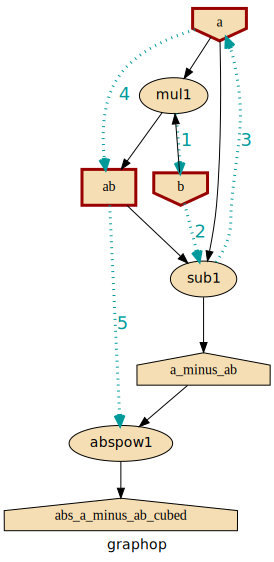
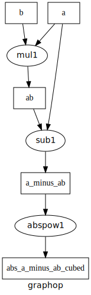

######################
Plotting and Debugging
######################

.. _plotting:

Plotting
--------

For :ref:`debugging` it is necessary to visualize the graph-operation.
You may plot the original plot and annotate on top the *execution plan* and
solution of the last computation, calling methods with arguments like this::

   graphop.plot(show=True)                # open a matplotlib window
   graphop.plot("graphop.svg")              # other supported formats: png, jpg, pdf, ...
   graphop.plot()                         # without arguments return a pydot.DOT object
   graphop.plot(solution=out)             # annotate graph with solution values

.. figure:: images/GraphkitLegend.svg
   :alt:  Graphkit Legend
   :width: 100%

   The legend for all graphkit diagrams, generated by :func:`graphkit.plot.legend()`.

The same ``plot()`` methods are defined on a :class:`NetworkOperation`,
:class:`Network` & :class:`ExecutionPlan`, each one capable to produce diagrams
with increasing complexity.  Whenever possible, the top-level ``plot()`` methods
delegates to the ones below.

For instance, when a net-operation has just been composed, plotting it will
come out bare bone, with just the 2 types of nodes (data & operations), their
dependencies, and the sequence of the execution-plan.

But as soon as you run it, the net plot calls will print more of the internals.
These are based on the ``graph_op.net.last_plan`` attribute which *caches*
the last run to inspect it.  If you want the bare-bone diagram, simply reset it::

   netop.net.last_plan = None

.. Note::
   For plots, `Graphviz <https://graphviz.org>`_ program must be in your PATH,
   and ``pydot`` & ``matplotlib`` python packages installed.
   You may install both when installing ``graphkit`` with its ``plot`` extras::

      pip install graphkit[plot]

.. Tip::
   The `pydot.Dot <https://pypi.org/project/pydot/>`_ instances returned by ``plot()``
   are rendered directly in *Jupyter/IPython* notebooks as SVG images.

.. _debugging:

Errors & debugging
------------------

Graphs may become arbitrary deep.  Launching a debugger-session to inspect
deeply nested stacks is notoriously hard

As a workaround, when some operation fails, the original exception gets annotated
with the folllowing properties, as a debug aid:

>>> from graphkit import compose, operation
>>> from pprint import pprint

>>> def scream(*args):
...     raise ValueError("Wrong!")

>>> try:
...     compose("errgraph")(
...        operation(name="screamer", needs=['a'], provides=["foo"])(scream)
...     )({'a': None})
... except ValueError as ex:
...     pprint(ex.graphkit_jetsam)
{'args': {'args': [None], 'kwargs': {}},
 'fnouts': ['foo'],
 'network':
  ...
 'operation': FunctionalOperation(name='screamer', needs=['a'], provides=['foo']),
 'outs': None,
 'plan': ExecutionPlan(inputs=('a',), outputs=(), steps:
  +--FunctionalOperation(name='screamer', needs=['a'], provides=['foo'])),
 'results': None,
 'solution': {'a': None}}

In interactive *REPL* console you may use this to get the last raised exception::

     import sys

     sys.last_value.graphkit_jetsam

The following annotated attributes *might* have meaningfull value on an exception:

``network``
   the innermost network owning the failed operation/function

``plan``
   the innermost plan that executing when a operation crashed

``operation``
   the innermost operation that failed

``operation_args``
    either a 2-tuple ``(args, kwargs)`` or just the ``args`` fed to the operation

``operation_fnouts``
    the names of the outputs the function was expected to return

``operation_outs``
    the names eventually the graph needed from the operation
    (a subset of the above)

``operation_results``
    the values dict, if any; it maybe a *zip* of the provides
    with the actual returned values of the function, ot the raw results.

.. note::
   The :ref:`plotting` capabilities, along with the above annotation of exceptions
   with the internal state of plan/operation often renders a debugger session
   unnecessary.  But since the state of the annotated values might be incomple,
   you may not always avoid one.

Execution internals
-------------------
.. automodule:: graphkit.network
   :noindex:
